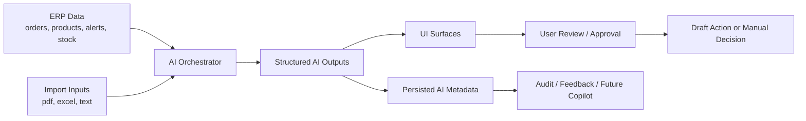

# AI Strategy
Status: Proposed  
Depends On: `domain-rules.md`, `implementation-roadmap.md`  
Last Updated: 2026-03-25  
Phase: Stage 2A — AI-First

## 1. Amaç
Bu belge, AI'ın ERP'yi deterministik operasyonel çekirdeğin yerine geçmeden nasıl güçlendireceğini tanımlar.

Hedefler:
- Ürünü veri gösteren bir sistemden karar destek sistemine dönüştürmek
- Konuşmalı copilot gelmeden önce görünür kullanıcı değeri üretmek
- AI'ı açıklanabilir, denetlenebilir ve domain kurallarıyla sınırlı tutmak
- İleride copilot deneyimini taşıyabilecek temiz bir AI katmanı kurmak

Bu belge bilinçli olarak hem ürün hem mimari seviyede yazılmıştır.
Şunları açıklar:
- AI bu aşamada ne yapmalı
- AI bu aşamada ne yapmamalı
- AI ürün içinde nasıl görünmeli
- AI mevcut ERP domain'i ile nasıl entegre olmalı

---

## 2. Temel Prensip

### 2.1 AI İkinci Zekâ Katmanıdır
Sistem üç katmandan oluşur:

1. Deterministic operational core
2. AI intelligence layer
3. Human approval and action layer

Deterministik çekirdek şu alanlarda authoritative kalır:
- stock reality
- reservations
- order status transitions
- production stock effects
- accounting and integration boundaries

AI şunları yapmalıdır:
- interpret
- score
- summarize
- forecast
- recommend

AI şunları yapmamalıdır:
- silently mutate operational truth
- bypass approval gates
- become the source of truth

### 2.2 Varsayılan Olarak Human-in-the-Loop
Bu fazda AI çıktıları, açıkça bir taslak iş akışına dönüştürülmedikçe öneri niteliğindedir.

İzin verilen AI çıktıları:
- explanation
- score
- summary
- anomaly flag
- recommendation
- draft creation proposal

İzin verilmeyen AI çıktıları:
- auto-approve order
- auto-ship order
- auto-adjust stock
- auto-complete production
- auto-create official accounting records

### 2.3 Açıklanabilirlik Ürün Gereksinimidir
Anlamlı her AI çıktısı şu sorulara cevap verebilmelidir:
- what was analyzed
- why this result was produced
- how confident the system is
- what the user can do next

---

## 3. Bu Fazdaki AI Kapsamı

Bu faz gömülü AI yüzeylerine odaklanır, konuşmalı AI'a değil.

### Stage 2A İçinde Olanlar
- Import Intelligence
- Order Review Risk
- AI Ops Summary
- Stock Risk Forecast
- Purchase Copilot v1

### Bilinçli Olarak Ertelenenler
- conversational copilot / chat interface
- autonomous action execution
- advanced long-horizon demand forecasting
- model fine-tuning from user feedback
- multi-agent workflow orchestration

Copilot reddedilmiyor. Gömülü AI katmanı güvenilir ve güven kazanan hale gelene kadar bilinçli olarak erteleniyor.

---

## 4. Ürün Çıktıları

Bu fazın sonunda ürün şuna benzemelidir:
- a system that understands incoming documents
- a system that warns before users manually notice issues
- a system that explains risk instead of only showing static numbers
- a system that proposes action without taking unsafe action

Henüz şuna benzememelidir:
- a free-form chat assistant
- a fully autonomous planner
- a black-box forecasting engine

---

## 5. AI Yetenek Haritası

## 5.1 Import Intelligence
Amaç:
- dağınık gelen veriyi yapılandırılmış taslak entity'lere dönüştürmek

Girdiler:
- PDF text
- Excel rows
- pasted text
- email body or attachment text

Çıktılar:
- parsed fields
- entity suggestions
- unmatched fields
- confidence score
- AI reason
- draft order proposal

Davranış:
- parse incoming document content
- infer customer fields when possible
- infer product/line matches when possible
- highlight low-confidence mappings
- create `ImportDraft` or `draft SalesOrder` only after user confirmation

UI yüzeyleri:
- `/dashboard/import`
- import preview cards
- field-level confidence badges
- unresolved field warnings

Başarı kriteri:
- reduces manual order entry time
- makes imports reviewable, not magical

---

## 5.2 Order Review Risk
Amaç:
- kullanıcıların onay öncesi şüpheli, eksik veya sıra dışı siparişleri daha iyi incelemesini sağlamak

Girdiler:
- customer completeness
- currency
- line count
- quantity scale
- discount scale
- notes presence
- order size

Çıktılar:
- `ai_risk_level`
- `ai_confidence`
- `ai_reason`

Davranış:
- classify order as `low`, `medium`, or `high`
- explain why the order deserves manual review
- remain advisory only

Önemli not:
- this is not payment risk
- this is not fraud scoring
- this is not credit scoring
- this is operational review risk

UI yüzeyleri:
- order detail page
- order list badges
- approval flow warnings

Başarı kriteri:
- users understand why an order needs review
- risk label feels justified, not random

---

## 5.3 AI Ops Summary
Amaç:
- yönetici ve operatörlere kısa bir günlük operasyon özeti vermek

Girdiler:
- critical stock counts
- warning stock counts
- pending order counts
- approved order counts
- high-risk order counts
- open alert counts
- top critical items

Çıktılar:
- short textual summary
- actionable insights
- anomaly list
- summary confidence

Davranış:
- produce a concise, operationally useful snapshot
- highlight action priorities
- avoid generic motivational language
- degrade gracefully when AI is unavailable

UI yüzeyleri:
- dashboard summary card
- alert center
- optional daily digest

Başarı kriteri:
- dashboard becomes faster to read
- users can answer “what needs attention today?” quickly

---

## 5.4 Stock Risk Forecast
Amaç:
- deterministik kritik seviyeye gelmeden stok riskini fark etmek

Girdiler:
- available_now
- daily_usage
- min_stock_level
- lead_time_days
- confirmed inbound if available
- open demand if available

Çıktılar:
- AI stock risk label
- confidence
- reason
- affected order count if available

Davranış:
- keep deterministic critical logic as the truth
- add early warning intelligence on top
- distinguish rule-based critical from AI-predicted risk

Sonuç ayrımı:
- deterministic critical = operational fact
- AI stock risk = forward-looking advisory layer

UI yüzeyleri:
- product list
- dashboard stock cards
- alerts page

Başarı kriteri:
- fewer “we only noticed after it became critical” cases

---

## 5.5 Purchase Copilot v1
Amaç:
- deterministik satın alma önerilerini AI bağlamıyla zenginleştirmek

Girdiler:
- deterministic purchase suggestion
- available_now
- min_stock_level
- daily_usage
- lead_time_days
- order concentration
- recent usage pattern

Çıktılar:
- recommendation explanation
- urgency level
- confidence
- rationale for quantity/timing

Davranış:
- build on top of deterministic planning logic
- explain timing and urgency
- never replace the deterministic engine silently
- remain advisory or draft-oriented

UI yüzeyleri:
- `/dashboard/purchase/suggested`
- alerts CTA flow
- dashboard recommendation panels

Başarı kriteri:
- recommendation cards feel credible
- users understand why the system suggests buying now

---

## 6. Konuşmalı Copilot'un Konumu

Konuşmalı copilot daha sonraki bir fazdır.

Sebep:
- the system first needs structured AI outputs
- explanation quality must stabilize before open-ended chat
- tool boundaries must be clear before conversational actions are allowed

Bu fazdan copilot'a taşınacak temel katmanlar:
- import intelligence outputs
- order review reasoning
- ops summary generation
- stock risk explanations
- purchase recommendation explanations

Copilot daha sonra geldiğinde, bu katmanı tüketmeli; paralel bir mantık sistemi icat etmemelidir.

---

## 7. Mimari Model

### 7.1 Orkestrasyon Kuralı
AI mantığı dağınık component çağrılarıyla değil, açık servis fonksiyonları üzerinden çalışmalıdır.

Tercih edilen katmanlar:
- route or server action
- AI service
- structured output mapper
- persistence layer
- UI presenter

### 7.2 Graceful Degradation
AI kullanılamıyorsa:
- the app still works
- deterministic logic still works
- UI should show a clean fallback
- no critical operation should fail because AI failed

### 7.3 Çıktı Yapılandırılmış Olmalıdır
Her AI yeteneği yalnızca serbest metin değil, yapılandırılmış alanlar üretmelidir.

Minimum ortak şema:
- `confidence`
- `ai_reason`
- `model_version`
- `generated_at`
- `inputs_summary`

---

## 8. Veri Modeli Ekleri

Mevcut sistem bazı AI alanlarını zaten saklıyor.
Bu faz, bu modeli daha standart hale getirmelidir.

## 8.1 Önerilen Tablolar

### `ai_runs`
Anlamlı her AI çalışmasını izler.

Önerilen alanlar:
- `id`
- `capability`
- `entity_type`
- `entity_id`
- `input_hash`
- `model`
- `status`
- `confidence`
- `reason`
- `raw_output`
- `created_at`

### `ai_recommendations`
Kullanıcıya gösterilen önerileri izler.

Önerilen alanlar:
- `id`
- `entity_type`
- `entity_id`
- `recommendation_type`
- `title`
- `body`
- `confidence`
- `severity`
- `status` (`suggested`, `accepted`, `edited`, `rejected`, `expired`)
- `model_version`
- `created_at`

### `ai_feedback`
Kullanıcıların AI'a nasıl tepki verdiğini izler.

Önerilen alanlar:
- `id`
- `recommendation_id`
- `feedback_type`
- `feedback_note`
- `actor`
- `created_at`

## 8.2 Genişletilecek Mevcut Entity'ler
Olası genişletmeler:
- `sales_orders`
  - `ai_risk_level`
  - `ai_confidence`
  - `ai_reason`
- `products`
  - `ai_risk_level`
  - `ai_confidence`
  - `ai_reason`
- `alerts`
  - AI-generated explanation fields
- `import_drafts`
  - parse confidence
  - unmatched fields

---

## 9. UX Kuralları

## 9.1 AI Görsel Olarak Ayrışmalıdır
Kullanıcı bir şeyin ne olduğunu ayırt edebilmelidir:
- a deterministic rule result
- an AI suggestion
- a user-approved action

Önerilen etiketler:
- `AI Önerisi`
- `AI Risk`
- `AI Özeti`
- `Confidence`
- `Neden bu öneri?`

## 9.2 AI Bir Sonraki Aksiyona Götürmelidir
Her AI çıktısı şu sonraki adımlardan en az birini desteklemelidir:
- go to detail
- review manually
- create draft
- dismiss
- re-run analysis

## 9.3 Kara Kutu Dili Kullanma
Şu tür muğlak etiketlerden kaçınılmalıdır:
- “sistem öneriyor”
- “yüksek risk”

Onun yerine:
- what triggered the result
- what data was considered
- what action is recommended

## 9.4 Sahte Otorite Kurma
AI çıktıları operasyonel açıdan hassas alanlarda nihai gerçek gibi sunulmamalıdır.

Örnekler:
- “AI riski” is not “stok kritik”
- “önerilen satın alma” is not “satın alma emri oluşturuldu”

---

## 10. Teslim Sırası

## Sprint 1
- Import Intelligence
- Order Review Risk hardening
- AI Ops Summary stabilization

Done kriteri:
- import creates trustworthy draft suggestions
- order risk is visible and explainable
- dashboard AI summary is useful and graceful when unavailable

## Sprint 2
- Stock Risk Forecast
- Purchase Copilot v1
- AI explanation polish in UI

Done kriteri:
- stock risk appears before deterministic critical in some cases
- purchase suggestions explain timing and urgency
- AI vs deterministic distinction is clear in UI

## Sprint 3
- anomaly detection
- AI feedback capture
- recommendation lifecycle

Done kriteri:
- the system learns what users accept or reject
- the product gains a reusable AI metadata layer

---

## 11. Başarı Metrikleri

## 11.1 Import Intelligence
- time from document upload to draft order
- percentage of fields accepted without manual correction
- confidence distribution

## 11.2 Order Review Risk
- approval review time
- ratio of accepted vs ignored AI warnings
- percentage of high-risk orders later edited

## 11.3 Ops Summary
- dashboard engagement with AI summary
- number of insight-driven navigations
- manual refresh/re-run frequency

## 11.4 Stock Risk and Purchase Suggestions
- number of early warnings before critical threshold
- accepted purchase suggestions
- false positive rate on stock risk

---

## 12. Güvenlik Korkulukları

### 12.1 Operasyonel Güvenlik
AI şunları yapamaz:
- change commercial status
- change fulfillment status
- mutate stock directly
- post official accounting outcomes

### 12.2 Auditability
Anlamlı her AI önerisi şu alanlara kadar izlenebilir olmalıdır:
- entity
- model/version
- timestamp
- confidence
- explanation

### 12.3 Fallback'ler
AI başarısız olduğunda:
- product stays functional
- deterministic core stays functional
- user sees a clean fallback state

### 12.4 Mahremiyet ve Kapsam
Modele yalnızca ilgili yetenek için gereken veri gönderilmelidir.
Gereksiz alan paylaşımından kaçınılmalıdır.

---

## 13. Bu Fazın Non-Goal'ları

Bu faz şunları içermez:
- free-form copilot chat
- auto-executed purchase orders
- auto-approved orders
- machine-control intelligence
- long-horizon statistical forecasting platform
- unsupervised autonomous planning

---

## 14. Karar Özeti

- AI ERP'yi güçlendirir, ERP çekirdeğinin yerini almaz
- Stage 2A konuşmalı AI'a değil, gömülü AI yüzeylerine odaklanır
- Import Intelligence, Order Review Risk, Ops Summary, Stock Risk Forecast ve Purchase Copilot v1 öncelikli yüzeylerdir
- Her AI çıktısı açıklanabilir, confidence skorlu ve gözden geçirilebilir olmalıdır
- Operasyonel açıdan hassas aksiyonlarda insan onayı zorunlu kalır
- Konuşmalı copilot daha sonra bu yapılandırılmış AI kabiliyetlerinin üstüne kurulacaktır
